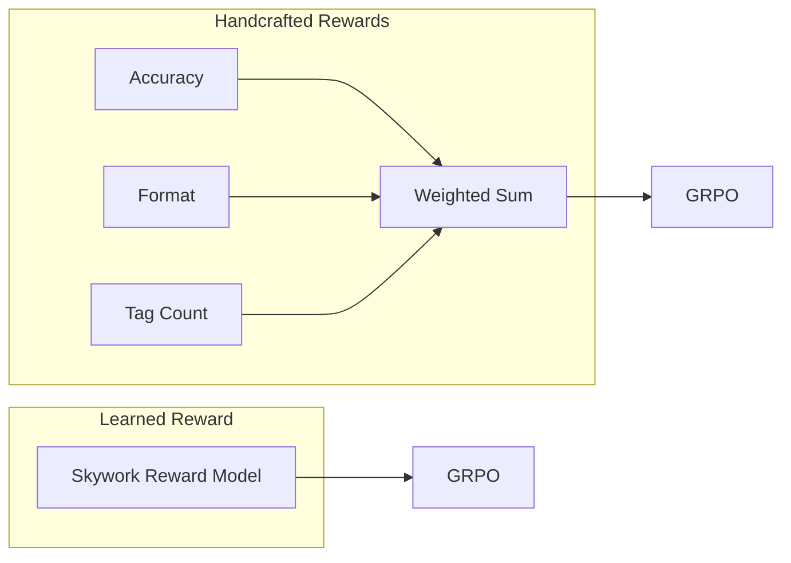
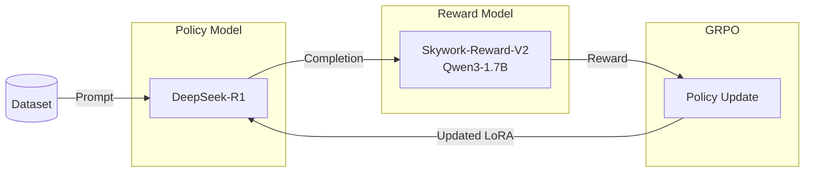

# External Plugin for MS-SWIFT

## Getting Started
There are two installation methods: **via Docker** (recommended) and **directly** (without Docker).

### Option 1: Installation via Docker

#### 1.1 Building the image

**CUDA 12.6 (default)**
```bash
docker build -t ms-swift-plugin .
```

**CUDA 13.0**
```bash
docker build \
  --build-arg CUDA_VERSION=13.0 \
  --build-arg CUDA_IMAGE=13.0.0-devel-ubuntu22.04 \
  -t ms-swift-plugin .
```

#### 1.2 Run the container

```bash
docker run --gpus all -it --name run-ms-swift \
  --shm-size=512g \
  --ulimit memlock=-1 \
  --ulimit stack=67108864 \
  -p 8011:8011 \
  --ipc=host \
  --network=host \
  ms-swift-plugin
```

After starting the container, the plugin will be available at /home/plugin.
MS-SWIFT is installed from source, and all dependencies are ready.

### Option 2: Install directly (without Docker)
#### 2.1 Clone and install MS-SWIFT

Note: The versions of torch, vllm, and deepspeed may vary depending on your CUDA.

### Dependency Compatibility Table

| Lib             | CUDA 12.6                                | CUDA 13.0                              |
|-----------------|------------------------------------------|----------------------------------------|
| **Base Image**  | `nvidia/cuda:12.6.0`                     | `nvidia/cuda:13.0.0`                   |
| **PyTorch**     | `torch==2.8.0`                           | `torch==2.11.0`                        |
| **Index URL**   | `https://download.pytorch.org/whl/cu126` | `https://download.pytorch.org/whl/cu130` |
| **vLLM**        | `vllm==0.19`                             | `vllm==0.23.0`                         |
| **DeepSpeed**   | `deepspeed==0.18.9`                      | `deepspeed>=0.18.9`                    |
| **Flash-Attn**  | `flash-attn==2.8.3`                      | `flash-attn==4.0.0b15`                 |
| **ms-swift**    | `version 4.x`                            | `version 4.x`                          |


```bash
git clone https://github.com/modelscope/ms-swift.git
cd ms-swift

# Install core package
pip install -e .

# Additional dependencies
pip install msgspec math_verify
pip install vllm==0.19
pip install deepspeed==0.18.9
pip install torch==2.8.0 --index-url https://download.pytorch.org/whl/cu126
```

#### 2.2 Adding an External Plugin

clone the plugin to any convenient location and specify the path using --external_plugins.

---

## Custom Reward

There are two possible approaches for evaluating results: through reward functions or through a reward model.



### Reward Function

#### Step 1: Define Reward Class

Create a Python file (e.g., `plugin.py`) and implement your reward logic:

```python
from swift.plugin import orms

class MyRewardFunction:
    def __call__(self, completions, **kwargs):
        # completions: list of model outputs
        # kwargs: dataset columns (e.g., ground truth, prompts)
        rewards = []
        for comp in completions:
            # Your custom reward calculation here
            reward = ...  
            rewards.append(reward)
        return rewards

# Register the reward function
orms['my_reward_function'] = MyRewardFunction
```

#### Step 2: Run with External Reward

```bash
swift rlhf \
    --external_plugins /path/to/plugin.py \
    --reward_funcs my_reward_function \
    ...
```

---

### Reward Model

Reward Model plugin for training **GRPO** with **MS-Swift** using **Skywork-Reward-V2-Qwen3-1.7B**.

The plugin replaces handcrafted reward functions (`reward_funcs`) with a learned Reward Model that directly predicts a scalar reward for every generated response.

The reward model predicts a **single scalar value** for each generated response.

```bash
swift rlhf \
    --reward_model /path/to/reward_model \
    --reward_model_plugin /path/to/rm_plugin.py \
    --external_plugins /path/to/plugin.py
```



## Training Commands

### Option 1: External Reward Function

```bash
bash swift-grpo-plugin/run_external_reward_func.sh
```

### Option 2: GRPO + LoRA + Colocate Mode

```bash
bash swift-grpo-plugin/run_lora.sh
```

### Option 3: GRPO + Colocate Mode (No LoRA)

```bash
bash swift-grpo-plugin/run_grpo_train.sh
```

---

## Example: GRPO + LoRA + Colocate Mode

```bash
nnodes=1
nproc_per_node=2

CUDA_VISIBLE_DEVICES=0,1 \
NNODES=$nnodes \
NODE_RANK=0 \
MASTER_PORT=8010 \
NPROC_PER_NODE=$nproc_per_node \
swift rlhf \
    --rlhf_type grpo \
    --use_hf true \
    --model Qwen/Qwen2-0.5B-Instruct \
    --reward_funcs accuracy format \
    --reward_weights 1 0.05 \
    --use_vllm true \
    --vllm_mode colocate \
    --vllm_gpu_memory_utilization 0.5 \
    --vllm_max_model_len 4096 \
    --tuner_type lora \
    --torch_dtype bfloat16 \
    --dataset /path/to/your/train_dataset \
    --val_dataset /path/to/your/val_dataset \
    --load_from_cache_file true \
    --max_completion_length 2048 \
    --num_train_epochs 1 \
    --per_device_train_batch_size 4 \
    --per_device_eval_batch_size 4 \
    --learning_rate 1e-6 \
    --gradient_accumulation_steps 4 \
    --eval_steps 100 \
    --save_steps 100 \
    --save_total_limit 2 \
    --logging_steps 50 \
    --max_length 4096 \
    --output_dir output \
    --warmup_ratio 0.05 \
    --dataloader_num_workers 4 \
    --dataset_num_proc 4 \
    --num_generations 4 \
    --temperature 0.9 \
    --system '/home/ms-swift/examples/train/grpo/prompt.txt' \
    --deepspeed zero2 \
    --log_completions true \
    --lora_rank 8 \
    --lora_alpha 32 \
    --target_modules all-linear
```

---

## Multi-Node Training (No Colocate Mode)

### 1. Rollout Servers

**Node 1 (Rollout):**
```bash
CUDA_VISIBLE_DEVICES=0,1,2,3 \
swift rollout \
    --model <model> \
    --vllm_tensor_parallel_size 2 \
    --vllm_data_parallel_size 2 \
    --port <node1_port>
```

**Node 2 (Rollout):**
```bash
CUDA_VISIBLE_DEVICES=0,1,2,3 \
swift rollout \
    --model <model> \
    --vllm_tensor_parallel_size 2 \
    --vllm_data_parallel_size 2 \
    --port <node2_port>
```

### 2. Training Nodes

**Master Node (Rank 0):**
```bash
NNODES=2 \
NODE_RANK=0 \
MASTER_ADDR=127.0.0.1 \
MASTER_PORT=29500 \
CUDA_VISIBLE_DEVICES=0,1,2,3 \
NPROC_PER_NODE=4 \
swift rlhf \
    --rlhf_type grpo \
    --model <model> \
    --reward_funcs accuracy \
    --use_vllm true \
    --vllm_mode server \
    --vllm_server_host <node1_ip> <node2_ip> \
    --vllm_server_port <node1_port> <node2_port> \
    --dataset /path/to/your/train_dataset \
    --val_dataset /path/to/your/val_dataset \
    --load_from_cache_file true \
    --max_completion_length 2048 \
    --per_device_train_batch_size 1 \
    --gradient_accumulation_steps 1 \
    --learning_rate 1e-6 \
    --save_total_limit 2 \
    --logging_steps 1 \
    --warmup_ratio 0.05 \
    --dataloader_num_workers 4 \
    --dataset_num_proc 4 \
    --num_generations 4 \
    --deepspeed zero2 \
    --log_completions true
```

**Secondary Node (Rank 1):**
```bash
NNODES=2 \
NODE_RANK=1 \
MASTER_ADDR=<node3_ip> \
MASTER_PORT=29500 \
CUDA_VISIBLE_DEVICES=0,1,2,3 \
NPROC_PER_NODE=4 \
swift rlhf \
    --rlhf_type grpo \
    --model <model> \
    --reward_funcs accuracy \
    --use_vllm true \
    --vllm_mode server \
    --vllm_server_host <node1_ip> <node2_ip> \
    --vllm_server_port <node1_port> <node2_port> \
    --dataset /path/to/your/train_dataset \
    --val_dataset /path/to/your/val_dataset \
    --load_from_cache_file true \
    --max_completion_length 2048 \
    --per_device_train_batch_size 1 \
    --gradient_accumulation_steps 1 \
    --learning_rate 1e-6 \
    --save_total_limit 2 \
    --logging_steps 1 \
    --warmup_ratio 0.05 \
    --dataloader_num_workers 4 \
    --dataset_num_proc 4 \
    --num_generations 4 \
    --deepspeed zero2 \
    --log_completions true
```